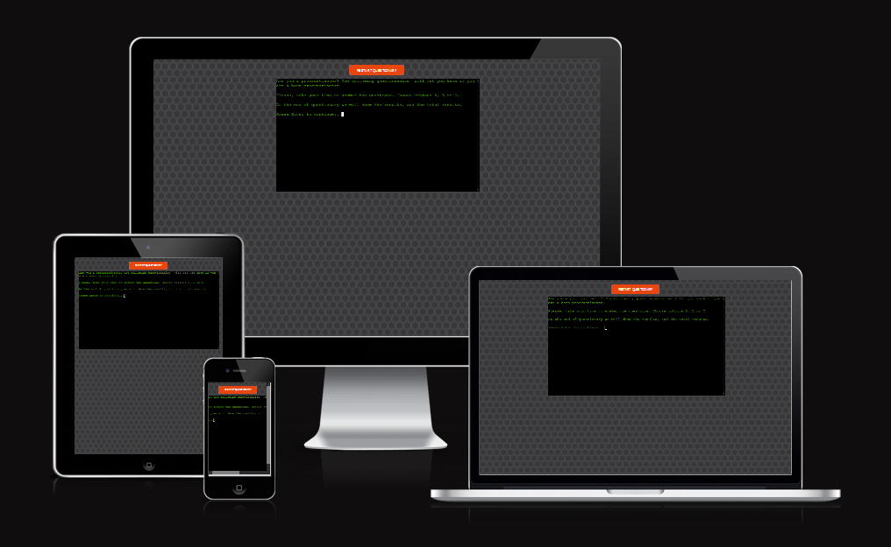
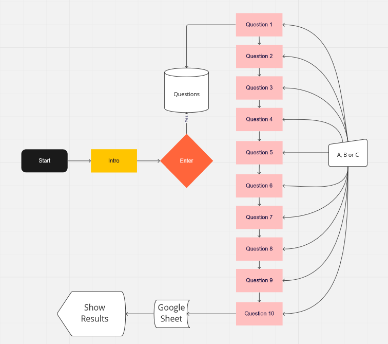
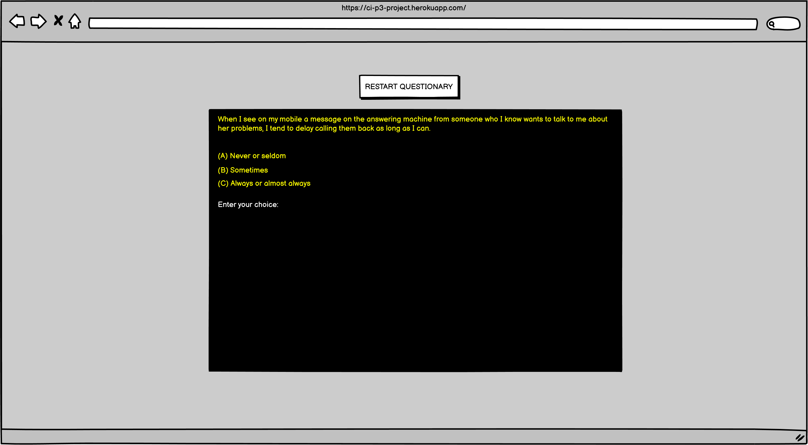
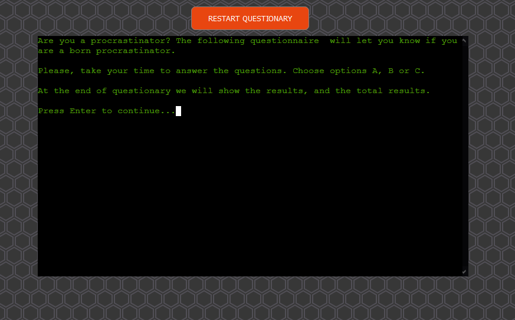
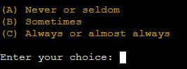
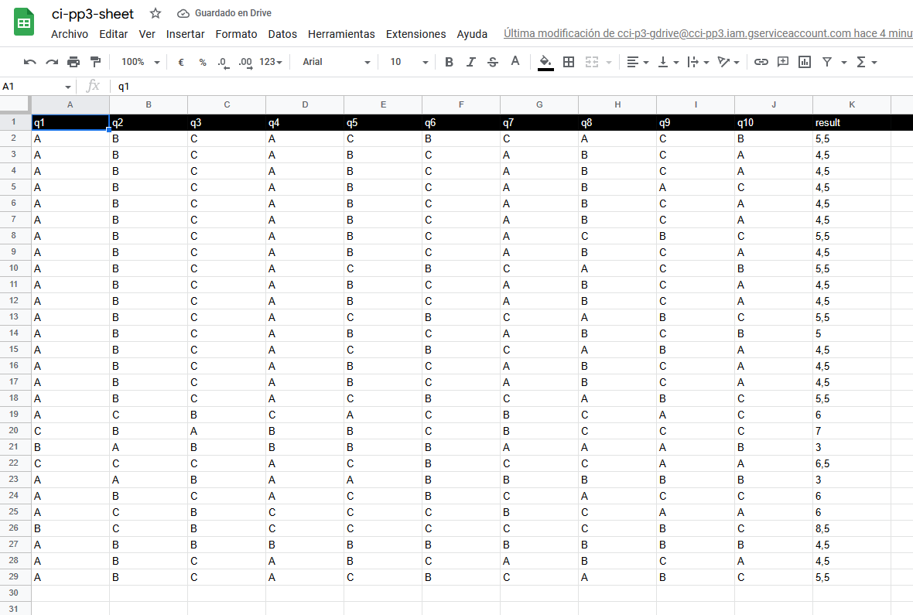

# Website
Procrastination questionary! 1.0

## Introduction

Questionnaire based on ten random questions to calculate the participant's procrastination level.

The value of each answer varies according to the option chosen. In this case, A = 0, B = 0.5, and C = 1.

The live website can be found on this [link](https://ci-p3-project.herokuapp.com).

# Table of Contents
 [1. UX Design](#ux)
  - [User Goals:](#user-goals)
  - [User Expectations:](#user-expectations)
  - [Colour scheme and font](#color-scheme)
  - [Website skeleton](#wireframes)
  - [Index](#index-page)
      
  [2. Features](#features)

  [3.Technologies](#technologies)

  [4.Testing](#testing-phase)

  [5.Bugs](#bugs)

  [6. Deployment](#deployment)

  [7. Acknowledgement](#acknowledgement)

  
# 1. UX design
  [Go to the top](#table-of-contents)

## 1.1 User Goals
  [Go to the top](#table-of-contents)
  
The objective of the application is to offer the participant a result on the level of procrastination based on ten random questions.

These questions are stored in a file called q1.txt, which has thirty questions. The application will generate ten random questions that it obtains from this file.

When the participant finishes the questionnaire, the answers will be stored in a Google Sheet file along with their total result in the questionnaire.

At the end of the questionnaire, it will show the result of the participant, and if there is more than one participant, it will show the number of participants and their total average.

## 1.2 User Expectations
  [Go to the top](#table-of-contents)
  
* Explanation and simple instructions for the user.
* Any user, regardless of their level, is capable of understanding and managing the application.
* The questionnaire is anonymous; at any time, a user can fill out the questionnaire.
* The user quickly understands the questions, and the options are clear.

## 1.3 Color Scheme
  [Go to the top](#table-of-contents)
  
* background: https://heropatterns.com/
* container: terminal with black background and white letters

## 1.4 Website Skeleton
  [Go to the top](#table-of-contents)
  
  [Balsamiq](https://balsamiq.com/) is the software that has been used to develop the wireframes of the web. It was handy to start the idea of the project, and with it, I could quickly generate the code of the web structure. Captures developed with the Balsamiq program are attached below.
  

### Diagram 

### Wireframe

  
# 2. Features
  [Go to the top](#table-of-contents)

  ### 2.1. Intro (1)

  - The questionnaire starts in the introductory text when the user presses the "Enter" key.

 

  ### 2.2. Questions file (2)

   - The file contains 30 questions of the questionnaire.

 

  ### 2.3. Questionary (3)

   - The questionnaire loads a question from the file randomly.

 

  ### 2.4. User options (4)

   - The user must choose between options A, B or C.

 

  ### 2.5. Google Sheet (5)

   - Google Sheet document that stores the user's responses and their total result.

 

  ### 2.6. User results (6)

    - Final screen that shows the result of the user's points.
    - Results are calculated from 0-2: Low, 2-5: Medium, 5-8: High and 8-10: Extreme.

 

  ### 2.7. Total results (7)

   - If there is more than one user in the Google Sheet document, it will show the number of participants and the total average.

 

  ### 2.8. Restart questionary (8)

  - Button to restart the questionnary

 

   
# 3. Technologies Used
  [Go to the top](#table-of-contents)

* [Balsamiq](https://balsamiq.com/) used for creating wireframes in Desktop and Mobile versions.
* [Chrome](https://www.google.com/intl/en_uk/chrome/) used for debugging and test the website.
* [Firefox Developer Edition](https://www.mozilla.org/es-ES/firefox/developer/) used for debugging and testing the website.
* [Github](https://github.com/) is used to create and update the online repository of the project.
* [Gitpod](https://www.gitpod.io/) used for coding the project online.
* [Ami](http://ami.responsivedesign.is/#) used for generate the different responsive versions of the project.
* [Heroku] is a platform as a service (PaaS) that enables developers to build, run, and operate applications entirely in the cloud, and was used to deploy the live project.
* [Google_Sheet] used to securely store user data entered in the project.
* [PEP8] is used to validate Python code.

## 3.1 Python libraries
[Go to the top](#table-of-contents)

* [colorama] used for text coloring
* [gspread] used for save questionary data and results
* [pytest] is used for test python code

  
# 4. Testing
  [Go to the top](#table-of-contents)
 
## 4.1 Testing using tools

### 4.1.1 Browser Developer tools

The built-in tools of the Google Chrome and Firefox Developer Edition browsers have been used in the project. In this case, inspect each HTML and CSS element. These tools were also used to run different performance and optimization tests, such as Google Chrome's Lighthouse or the tools included to view the web on different device sizes.

 

### 4.1.2 Pytest

To load the pytest tests you must run the command "pytest .\test_questionary.py" from the root directory.

 

### 4.1.3 PIP3 Validator

For the validation of the python code, the official tool has been used [pythonchecker](https://www.pythonchecker.com/).

 

## 4.2 Manual Testing

 ## run.py:
TEST            | RESULT                           | OK / FAIL  
--------------- | -------------------------------- | ---------------
Run | Running Main function of Class Start | OK

 ## modules/start.py:
TEST            | RESULT                           | OK / FAIL  
--------------- | -------------------------------- | ---------------
print_intro | Running Main function of Class Start | OK
press_enter_continue | Continue when press Enter key | OK
run_questionary | Run questions, calculate points and added to row | OK
print_user_result | Show user result | OK
print_total_result | Show total of participants and average | OK

 ## modules/functions.py:

TEST            | RESULT                           | OK / FAIL  
--------------- | -------------------------------- | ---------------
print_intro | Running Main function of Class Start | OK
press_enter_continue | Continue when press Enter key | OK
gspread_add_row_questionary | Added row to Google Sheet | OK
run_questionary | Run questions, calculate points and added to row | OK
print_options | Show questionary options A, B and C | OK
questionary_total | Calculate points base on choices | OK
print_user_result | Show user result | OK
print_total_result | Show total of participants and average | OK
shuffle_questions | Open file q1.txt and shuffle questions | OK

 ## modules/utils.py:

TEST            | RESULT                           | OK / FAIL  
--------------- | -------------------------------- | ---------------
cls | clear screen windows/linux | OK

  ## q1.text:

TEST            | RESULT                           | OK / FAIL  
--------------- | -------------------------------- | ---------------
questions | count 30 questions in file | OK

  
# 5. Bugs
  [Go to the top](#table-of-contents)

  ## Solved bugs

  - Clear shell screen when needed depending on OS (linux and windows) with modules.Utils.cls()
  - Show numbers in print results by convert numbers to str with function str()
  - Splitting print lines adapting the max numbers of characters with ","
  - Using @staticmethod in functions to declare static methods in modules.functions()
  - Get properly formatted numbers from Google Sheet with the parameter value_render_option="UNFORMATTED_VALUE" in Functions.print_total_result()
  - Added encoding="utf8" in line 161 of modules.functions.py to fix pyling suggestion
  - Install pytest and addecuate all the functions in test_questionary.py
  - Modified to str(round(sum(values_list) / len(values_list), 2)) in line 150 to show the total average of participants results

  
# 6. Deployment
  [Go to the top](#table-of-contents)
 
The main branch of this repository has been used for the deployed version of this application.

## Via Gitpod

The project deployment was based on the [Code-Institute-Org / python-essentials-template](https://github.com/Code-Institute-Org/python-essentials-template).

  - Click the `Use This Template` button.
  - Add a repository name and brief description.
  - Click the `Create Repository from Template` to create your repository.
  - To create a Gitpod workspace you then need to click `Gitpod`, this can take a few minutes.
  - When you want to work on the project it is best to open the workspace from Gitpod (rather than Github) as this will open your previous workspace rather than create a new one. You should pin the workspace so that it isn't deleted.
  -  Committing your work should be done often and should have clear/explanatory messages, use the following commands to make your commits:
    - `git add .`: adds all modified files to a staging area
    - `git commit -m "A message explaining your commit"`: commits all changes to a local repository.
    - `git push`: pushes all your committed changes to your Github repository.

*Forking the GitHub Repository*

If you want to make changes to your repository without affecting it, you can make a copy of it by 'Forking' it. This ensures your original repository remains unchanged.

  1. Find the relevant GitHub repository
  2. In the top right corner of the page, click the Fork button (under your account)
  3. Your repository has now been 'Forked' and you have a copy to work on

*Cloning the GitHub Repository*

Cloning your repository will allow you to download a local version of the repository to be worked on. Cloning can also be a great way to backup your work.

  1. Find the relevant GitHub repository
  2. Press the arrow on the Code button
  3. Copy the link that is shown in the drop-down
  4. Now open Gitpod & select the directory location where you would like the clone created
  5. In the terminal type 'git clone' & then paste the link you copied on GitHub
  6. Press enter and your local clone will be created.

## Via Heroku

The project was deployed to Heroku using the following steps...

1. Log in to [Heroku](https://www.heroku.com/) and if not taken there
   automatically, navigate to your personal app dashboard.
1. At the top of the page locate the 'New' drop down, click it and then select
   'Create new app'.
1. Give your application a unique name, select a region appropriate to your
   location and click the 'Create app' button.
1. Your app should now be created so from the menu towards the top of the page
   click 'Settings'
1. Click 'Reveal Config Vars' in the Config vars section and enter the key as
   `PORT` and the value as `8000`. Click the Add button.
1. Under the 'Buildpacks' section click 'Add buildpack'.
    1. Select 'Python' and then click the 'Save changes' button.
    1. Click 'Add buildpack' again, select 'nodejs' and click the 'Save changes'
       button again.
    1. Ensure the build packs are ordered as below:
        1. `heroku/python`
        2. `heroku/nodejs`
1. Navigate to the 'Deploy' page using the menu towards the top of the page.
1. Select 'GitHub' from the 'Deployment method' section and you will be prompted
   to 'Connect to GitHub'.
1. Once connected to your GitHub account you will be able to search for your
   repository which contains the battleships code.
1. Once the repository is found click 'Connect'.
1. At the bottom of the page find the section named 'Manual deploy', select the
   'main' branch in the drop down and click the 'Deploy' button.
1. Once deployment is complete, click the 'View' button to load the URL of the
   deployed application.

Please note it can take a while for this link to become fully active. 

The live link can be found [here](https://ci-p3-project.herokuapp.com).

  
# 7. Acknowledgement
  [Go to the top](#table-of-contents)
 
## Code

- codeinstitute.net
- w3schools.com

## Content

- Many thanks to kasia_ci from Code Institute for all the guidance and info well provided during these weeks in the slack channel #msletb-mar-2022.
- Also thanks to channel buddies in #peer-code-review for the code suggestions.